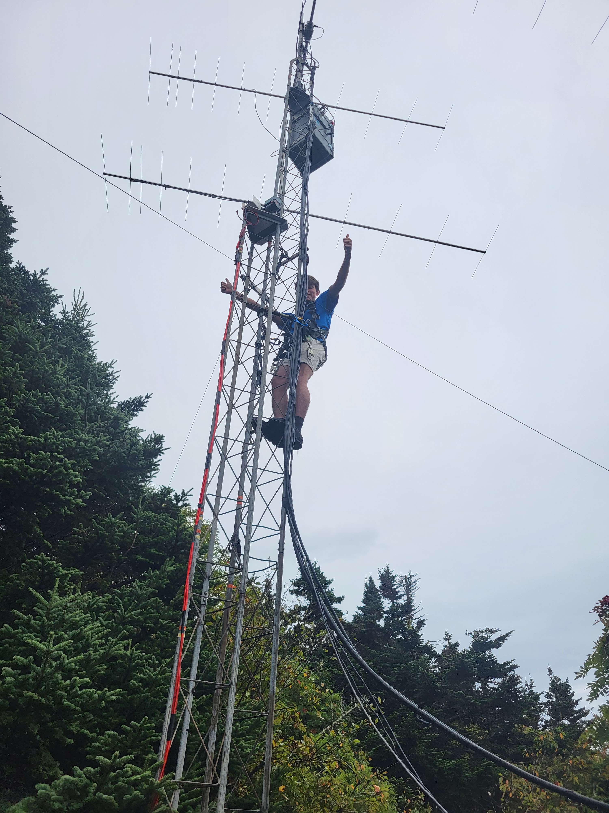
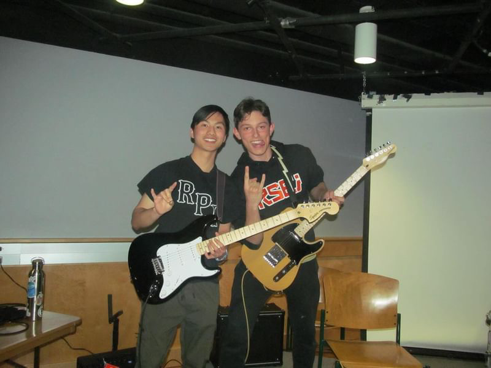

+++
title = "Home"
template = "section.html"
+++

# Alectronix Electronic Hobby Website

## About me
I am a student at Rensselaer Polytechnic Institute studying Electrical Engineering, and I have a broad interest in electronics. More specifically, I like working with:
* Microcontrollers/Embedded systems
* PCB design
* Radio communication
* Energy storage
* 3D modeling

### Also about me
I play the guitar and drums, and I love camping, gardening, gaming, and woodworking. Do not introduce me to any more hobbies or I will not be able to finish my homework.

## About this website
This website is intended to be a place for me to organize my projects, as well as practice my github and programming skills. If you are looking to learn more about any of the projects on this website, please send me an email at ah@alectronix.net.

