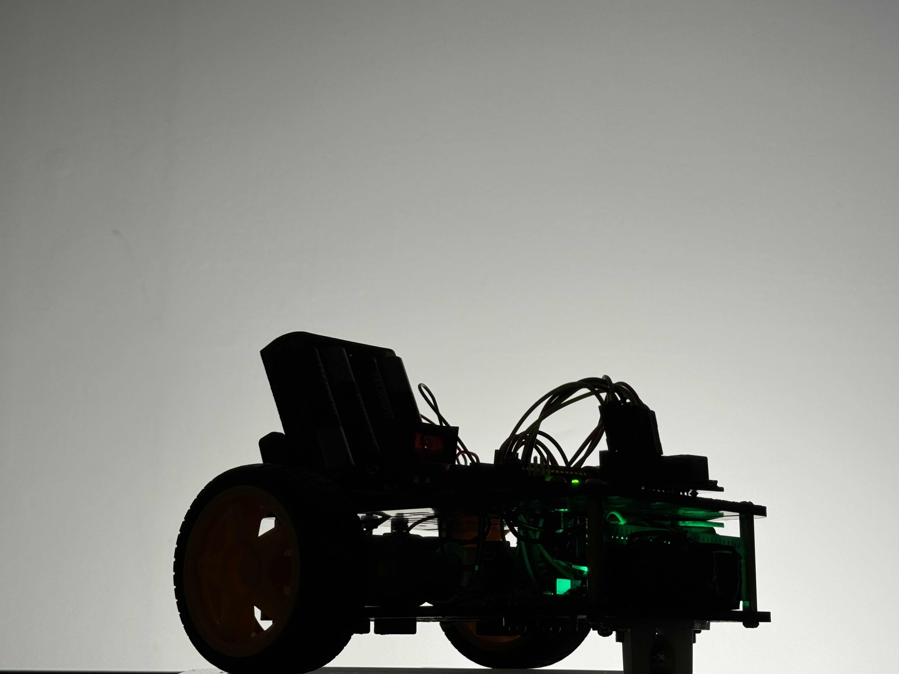

+++
title = "Line Follower Car"
description = "An Intro to Engineering Design Mini-Project"
date = 2024-07-20
+++

# Introduction
The first project in Intro to Engineering Design, also known as the mini project, gives students three options for choosing a topic. Those options are:
* Marshmallow launcher
* Mousetrap car
* Line follower
I decided to build a line follower since I wanted to work with microcontrollers and control systems. In this post, I will be omitting most considerations made for the class, and instead will be focusing on the technical details of the actual project.

# Design
The goal of a line follower is to travel along a high contrast line that is drawn onto the ground, as quickly and accurately as possible.

When designing this system, I started by determining the expected inputs and outputs to the line-follower considered as a system. The input would be some kind of sensor data to determine its position with respect to the line, and the output would be movement for the motors.

Inexpensive line-follower sensors are composed of an infrared LED and an infrared sensor, along with an integrated circuit that interprets the analog value of the infrared sensor to determine if a surface reflects (white) or absorbs (black) the infrared light. This sensor package is then able to output a high or low state. Using two sensors would be the cheapest and simplest way to control the car, since it could be designed to drive forward and just turn left or right if the sensors detect the line. However, using four of these sensors allows us to increase the resolution of the “location” of the car, which allows for a control system that is much more dynamic, precise, and fast.

To begin, we were given a chassis that included two wheels, two motors with high torque gearboxes, a chassis with a low-friction ball underneath it, a 4s AA battery pack, and an H bridge motor driver. Additionally, we were allowed to use either analog electronics 